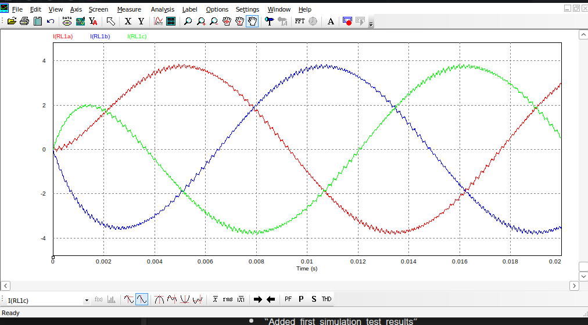

# 🛰️ 3-Phase SPWM Inverter Simulation (PSIM)

## Project Overview

This project demonstrates the design and simulation of a **Three-Phase Sinusoidal Pulse Width Modulation (SPWM) Inverter** using **PSIM**.  
The simulation models a **high-efficiency aerospace-grade inverter**, the kind used in aircraft electrical systems, propulsion drives, and defense-grade avionics.

## Objectives

- Design and simulate a 3-phase SPWM inverter for **aircraft power systems**.  
- Achieve **clean sinusoidal output** with minimal harmonics.  
- Observe gate signal synchronization and load response.  
- Build a reproducible foundation for **next-generation aerospace power electronics**.

## Simulation Details

| Parameter | Description |
|------------|-------------|
| **Simulation Tool** | PSIM 11.1.3 (Demo) |
| **Topology** | 3-Phase Full-Bridge Inverter |
| **Modulation** | Sinusoidal PWM |
| **Load** | R-L Load (Aircraft motor emulation) |
| **Input Voltage** | 100 V DC |
| **Output** | 3-Phase AC |
| **Application** | Avionics / Aircraft Power Distribution |

## PSIM Environment

Simulation environment and module configuration are documented in [notes.txt](docs/notes.txt).  
*(Includes: Motor Drive, Digital Control, Renewable Energy, Thermal Modules)*

## Expected Results

- Generation of balanced, phase-shifted AC output.  
- Accurate gating and SPWM synchronization.  
- Low harmonic distortion in output waveform.  
- Demonstration of aerospace-relevant inverter dynamics.

**Sample waveform (post-simulation):**  

## Reference

Original base concept adapted from:  
 [Three-Phase SPWM Inverter Simulation in PSIM — Electronics Maddy (YouTube)](https://www.youtube.com/watch?v=0cxj5Xp-rfI)  
*(Re-implemented and documented for aerospace system applications.)*

## Future Development

- Integrate real-time control using **DSP or FPGA-based PWM units**.  
- Add **closed-loop feedback** for load and frequency regulation.  
- Extend simulation to **hybrid-electric propulsion architectures**.  
- Explore **defense-grade power converter optimization**.

## License

Released under the **MIT License**, open for research, educational, and defense-technology adaptation.  
See [LICENSE](LICENSE) for terms.

## Author

**Boureima Tall Ali**  
Electronics & Electrical Engineering, *Islamic University of Technology (IUT)*  
Specialization: **Avionics, Aerospace Systems & Defense Technology**  
GitHub: [tall-ali](https://github.com/tall-ali)

